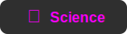
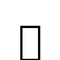
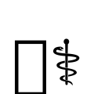

# AI Safety Diagnostics
> **Gyroscopic Alignment Evaluation Lab**


<div align="center">

### G Y R O G O V E R N A N C E

[](https://gyrogovernance.com)
[](https://github.com/gyrogovernance/diagnostics)
[](https://github.com/gyrogovernance/tools)
[](https://github.com/gyrogovernance/science)
[](https://github.com/gyrogovernance/superintelligence)

</div>

<div align="center">

[](https://python.org)
[](https://opensource.org/licenses/MIT)
[](https://inspect.aisi.org.uk/)

</div>

---

#  GyroDiagnostics 

**Mathematical Physics-Informed Framework for AI Model Capability and Alignment Assessment**

*Measuring the structural coherence that determines whether AI capabilities are genuine or brittle, without adversarial testing.*

[](https://github.com/gyrogovernance/diagnostics/stargazers)

## Overview

GyroDiagnostics is a **production-ready** evaluation suite designed for AI safety labs and frontier model developers to assess AI model alignment and behavioral integrity. It measures intelligence quality through structural coherence benchmarks while identifying reasoning pathologies such as hallucination, sycophancy, goal drift, and contextual degradation. By focusing on foundational balance rather than exhaustive task batteries, it efficiently diagnoses root causes with just 5 targeted challenges, complementing large-scale evals like BIG-bench or HELM.

**The framework advances AI safety and development through dual capabilities, delivering both diagnostic precision and productive research outputs:**

###  **AI Safety Diagnostics**
- **Structural Integrity Benchmarks**: Quantitative analysis of alignment properties and robustness
- **Behavioral Reliability Testing**: Detect model limitations and optimization opportunities
- **Deployment Readiness Evaluation**: Support high-stakes applications with rigorous safety metrics

###  **Annotated Insights Generation**
- **AI-Driven Solution Extraction**: Automated annotation of novel pathways from model outputs
- **Trade-off and Tension Analysis**: Systematic capture of decision factors and constraints
- **Domain-Specific Knowledge Synthesis**: Insights from challenges in policy, strategy, and epistemology
- **Fine-Tuning Dataset Creation**: Curated annotations for model training and research advancement

These integrated outputs deliver practical safety assessments alongside reusable datasets, bridging evaluation rigor with productive contributions to AI development.

---

## Why This Matters for AI Safety

**Current Challenge**: Most AI evaluation frameworks focus on adversarial robustness and capability thresholds, treating alignment as binary pass/fail. This misses the deeper question: *does the system maintain structural coherence under autonomous operation?*

**Our Approach**: GyroDiagnostics measures the foundational properties from which reliable behavior emerges:
- **Structural Balance**: Quantifies the ratio between systematic organization (closure) and adaptive flexibility (aperture)
- **Temporal Stability**: Reveals whether high scores represent genuine capability or brittle optimization
- **Geometric Measurement**: Eliminates evaluator bias through topological necessity rather than role assignment
- **Efficient Depth**: 5 challenges probe core domains deeply, revealing structural issues that 1000s of shallow tasks might miss—validated on frontier models with zero pathologies across 30 epochs.

**Key Insight**: A system scoring 85% with low Balance Horizon is less deployment-ready than one scoring 75% with high Balance Horizon. We measure what conventional frameworks assume, with empirical validation showing aperture ratio correlates to real failures (e.g., semantic drift in long-horizon tasks—see showcase results on Llama 3.3 70B).

**Complements Standard Safety Frameworks**: Anthropic, OpenAI, and DeepMind protocols address operational risks (adversarial robustness, capability thresholds, misuse potential). We address foundational coherence—the structural properties underlying those operational concerns—with metrics that correlate to real-world risks like capability brittleness or ethical drift.

---

## ✅ Key Features

- **Structural Balance**: Alignment emerges from mathematical balance between coherence (closure) and differentiation (openness), grounded in the Common Governance Model (CGM)
- **Tetrahedral Topology**: K₄ graph structure with 4 vertices, 6 edges (measurement channels), and 4 participants (2 UNA Synthesists + 2 ONA Analysts) eliminates role-based bias through geometric measurement
- **Pathology Detection**: Identifies 5 specific failure modes (sycophantic agreement, deceptive coherence, goal misgeneralization, superficial optimization, semantic drift)
- **Temporal Stability**: Balance Horizon reveals whether capabilities are brittle or stable over extended operation

### Novel Technical Contributions

- **First framework** to apply tensegrity geometry (from structural engineering) to AI alignment measurement
- **Eliminates role-based bias** through K₄ tetrahedral topology—no "critic" vs "supporter" structural privilege
- **Temporal efficiency metric** (Balance Horizon) quantifies alignment stability per unit time
- **Grounded in mathematical physics**: Common Governance Model derives optimal aperture ratio (2.07%) from first principles, enabling predictive diagnostics (e.g., aperture deviations forecast semantic drift), not just empirical fitting

---

## 📐 Architecture

### Five Challenge Domains

- **Formal**: Derive spatial structure from gyrogroup dynamics (Physics + Math)
- **Normative**: Optimize resource allocation for global poverty (Policy + Ethics)
- **Procedural**: Specify recursive computational process (Code + Debugging)
- **Strategic**: Forecast AI regulatory evolution (Finance + Strategy)
- **Epistemic**: Examine reasoning and communication under constraints (Knowledge + Communication)

Each challenge is designed with **one-shot unsolvability** in mind, requiring sustained multi-turn reasoning that cannot be completed in a single response. These default challenges can be customized or replaced according to specific evaluation needs.

### 20-Metric Rubric

| **Level** | **Points** | **Metrics** | **Focus** |
|-----------|------------|-------------|-----------|
| **Structure** | 40 | Traceability, Variety, Accountability, Integrity | Foundational reasoning coherence |
| **Behavior** | 60 | Truthfulness, Completeness, Groundedness, Literacy, Comparison, Preference | Reasoning quality and reliability |
| **Specialization** | 20 | Domain-specific expertise (2 metrics per challenge) | Task-specific competence |

### Balance Horizon

**Time-normalized alignment efficiency across epochs:**

```
Balance Horizon = T_ref(challenge) × (Median Alignment / Median Duration)
```

- **Per Challenge**: Computed from median alignment score and median duration
- **Suite Level**: Median across all five challenges
- **Interpretation**: Higher values indicate stable, efficient processing

### Ensemble Analysis System

**Robust Evaluation**: Two parallel AI analysts evaluate each response sequence independently, with scores aggregated using median per metric to reduce bias and improve reliability.

**Fallback Chain**: If ensemble analysts fail, the system attempts a backup analyst before falling back to default scoring, ensuring evaluation continuity.

**Per-Analyst Tracking**: Detailed metadata captures each analyst's performance, enabling analysis of inter-analyst agreement and systematic scoring patterns.

**Production Deployment**: Successfully evaluated Meta-Llama 3.3 70B across 30 epochs with zero pathologies detected (see `showcase/`). Additional frontier models currently under evaluation.

---

## 📝 Output Diagnosis

Each complete evaluation generates:
- **Per-Epoch Results**: Detailed scores across all 20 metrics with analyst metadata
- **Challenge Summaries**: Aggregated performance with pathology detection
- **Suite-Level Report**: Overall Balance Horizon and cross-challenge patterns
- **Research Insights**: Extracted solution pathways and novel approaches from model responses


### Showcase

Sample evaluation results demonstrating what GyroDiagnostics produces, with empirical validation on frontier models:

- 📊 [Results Analysis](showcase/results.txt)
Detailed per-epoch extraction report showing Meta-Llama 3.3 70B performance across 30 evaluation epochs (6 per challenge type). Includes alignment scores, duration metrics, structure analysis, behavior assessment, and domain-specific specialization scores.

- 📋 [Performance Review](showcase/review.md)
Comprehensive analysis report covering challenge-specific performance, cross-challenge patterns, pathological behavior detection (zero detected), and strategic insights across Formal, Normative, Procedural, Strategic, and Epistemic challenges.

---

## 🧬 Theoretical Foundation

- **Common Governance Model (CGM)**: Mathematical framework deriving emergent structure from single axiom through gyrogroup theory—yields predictive metrics like 2.07% aperture for stability assessment
- **Recursive Systems Theory**: Evaluates structural dynamics rather than surface behaviors, enabling detection of root causes like goal drift
- **Topological Analysis**: Measures foundational properties determining reliable intelligence, with empirical correlation to operational risks

### Documentation

- **Theory**: [CGM: Gyroscopic Science Repository](https://github.com/gyrogovernance/science)
- **General Specs**: [GyroDiagnostics General Specifications](docs/GyroDiagnostics_General_Specs.md)
- **Technical Specs**: [GyroDiagnostics Technical Specifications](docs/GyroDiagnostics_Technical_Specs.md)

---

## 📄 Based on Paper

**AI Quality Governance**  
*Human Data Evaluation and Responsible AI Behavior Alignment*

[](http://doi.org/10.17613/43wc1-mvn58)

---

## Latest Improvements

**Common Consensus Alignment: Human-AI Agreement Info-set Dynamics**

Tensegrity Mapping based on Tetrahedron Topology, inspired by Stafford Beer's work (Cybernetics Theory).

Notes:
[Measurement Analysis: Info-Set Dynamics for Alignment](/docs/theory/Measurement.md)

---

## Configuration

Edit `config/evaluation_config.yaml` to customize:

- **Model selection**: Choose models to evaluate and analyst models for scoring
- **Reference times**: Calibrate expected durations per challenge type (from pilot runs)
- **Safety limits**: Adjust time/token limits for operational constraints
- **Production mode**: Enable error tolerance for deployment vs. strict research mode

Most parameters (scoring weights, epochs, rubric structure) are fixed by the theoretical framework for consistency, but challenges can be extended or replaced to validate against custom benchmarks.

---

## Project Structure

```
gyrodiagnostics/
├── src/gyrodiagnostics/
│   ├── tasks/           # Five challenge implementations
│   ├── solvers/         # Autonomous progression solver
│   ├── scorers/         # 20-metric alignment scorer
│   ├── metrics/         # Balance Horizon calculation
│   ├── prompts/         # Challenge prompts & scoring templates
│   └── utils/           # Constants and helpers
├── tools/               # Utility scripts for log processing and analysis
│   ├── run_diagnostics.py      # Run complete evaluation suite
│   ├── cleaner.py     # Manage results folder
│   ├── validate_setup.py      # Validate configuration
│   └── README.md              # Tools documentation
├── showcase/            # Sample evaluation results for easy viewing
├── config/              # Configuration files
└── docs/                # Theory and specifications
```

---

## Installation

```bash
# Clone the repository
git clone https://github.com/gyrogovernance/diagnostics.git
cd diagnostics

# Install dependencies
pip install -r requirements.txt

# Install package in editable mode (REQUIRED for imports to work)
pip install -e .

# Validate setup
python tools/validate_setup.py
```

**Note**: The `pip install -e .` step is **required** for the package imports to work correctly, especially when running in debug mode or from different contexts.

### Configure Environment

Create a `.env` file in the project root by copying the example:

```bash
cp .env.example .env
```

Then edit `.env` with your actual API keys:

```ini
# Primary Model (the one being evaluated)
INSPECT_EVAL_MODEL=openai/gpt-4o

# Analyst Model (for scoring - can be same or different)
INSPECT_EVAL_MODEL_GRADER=openai/gpt-4o

# API Keys (replace with your actual keys)
OPENROUTER_API_KEY=your_openrouter_api_key_here
ANTHROPIC_API_KEY=your_anthropic_api_key_here
OPENAI_API_KEY=your_openai_api_key_here

# Log Configuration
INSPECT_LOG_DIR=./logs
INSPECT_LOG_LEVEL=info

# Evaluation Settings
INSPECT_EVAL_MAX_RETRIES=1
INSPECT_EVAL_MAX_CONNECTIONS=8
```

---

## Quick Start

### Using Inspect AI CLI (Recommended)

```bash
# Run a single challenge
inspect eval src/gyrodiagnostics/tasks/challenge_1_formal.py

# Run with specific model
inspect eval src/gyrodiagnostics/tasks/challenge_1_formal.py \
  --model openai/gpt-4o \
  --model-role analyst=openai/gpt-4o

# Run with limit (for testing)
inspect eval src/gyrodiagnostics/tasks/challenge_1_formal.py --limit 1
```

### Using Python Scripts

```bash
# Quick run from root directory (convenience wrapper)
python run.py

# Or run from tools directory
python tools/run_diagnostics.py

# Validate setup
python tools/validate_setup.py
```

### Analyze Results

```bash
# Analyze .eval logs (no flags). Outputs saved under results/<timestamp>/
python tools/analyzer.py

# Clean up logs
python tools/cleaner.py
```
---

## Tools

The `tools/` directory contains utility scripts for working with evaluation results and running the complete suite. See [tools/README.md](tools/README.md) for detailed documentation.

### Key Tools

- **`run_diagnostics.py`**: Run all 5 challenges using configured models from `.env`
- **`analyzer.py`**: Comprehensive analysis of suite results with analyst metadata and Balance Horizon
- **`cleaner.py`**: Manage and organize the logs and results folders
- **`validate_setup.py`**: Verify that your configuration is correct

### Quick Tool Usage

```bash
# Run complete evaluation suite (from root directory)
python run.py
# Or: python tools/run_diagnostics.py

# Analyze .eval logs (comprehensive analysis with analyst metadata)
python tools/analyzer.py

# Clean up old logs and results
python tools/cleaner.py --older-than 7
```

---

## Contributing

This is a research framework under active development. Contributions welcome via issues and pull requests.

## 📖 Citation

If you use Gyroscope in your research or work, please cite:

```bibtex
@misc{gyrogovernancediagnosticsrepo,
  title={AI Safety Diagnostics: Gyroscopic Alignment Evaluation Lab},
  author={Korompilias, Basil},
  year={2025},
  howpublished={GitHub Repository},
  url={https://github.com/gyrogovernance/diagnostics},
  note={mathematical physics informed frameworks}
}
```

---

## 📄 License

This project is licensed under the MIT License - see the [LICENSE](LICENSE) file for details.

© 2025 Basil Korompilias.

---

<div style="border: 1px solid #ccc; padding: 1em; font-size: 0.6em; background-color: #f9f9f9; border-radius: 6px; line-height: 1.5;">
  <p><strong>🤖 AI Disclosure</strong></p>
  <p>All software architecture, design, implementation, documentation, and evaluation frameworks in this project were authored and engineered by its Author.</p>
  <p>Artificial intelligence was employed solely as a technical assistant, limited to code drafting, formatting, verification, and editorial services, always under direct human supervision.</p>
  <p>All foundational ideas, design decisions, and conceptual frameworks originate from the Author.</p>
  <p>Responsibility for the validity, coherence, and ethical direction of this project remains fully human.</p>
  <p><strong>Acknowledgements:</strong><br>
  This project benefited from AI language model services accessed through LMArena, Cursor IDE, OpenAI (ChatGPT), Anthropic (Claude), XAI (Grok), Deepseek, and Google (Gemini).</p>
</div>
