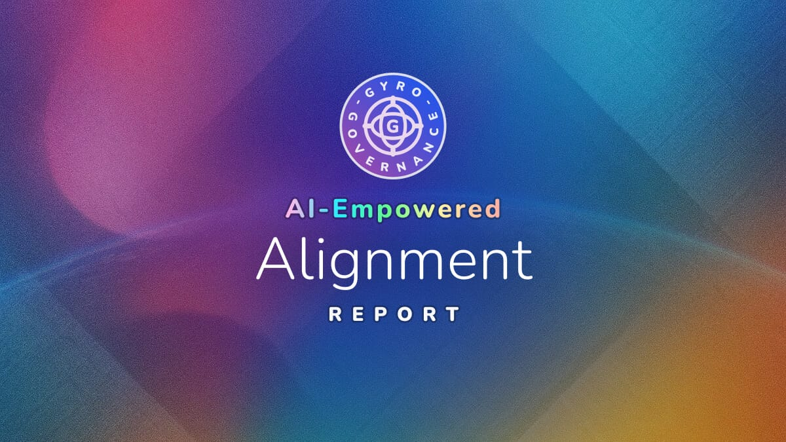

# 🧠 AI-Empowered Alignment: Epistemic Constraints and Human-AI Cooperation Mechanisms

**Meta-Description**: Frontier AI models reveal fundamental constraints on autonomous reasoning through recursive self-reference analysis, demonstrating why human-AI cooperation remains structurally necessary despite advancing capabilities.

**Keywords**: AI alignment, epistemic limits, self-referential reasoning, cognitive constraints, autonomous systems, recursive cognition, linguistic bias, human-AI cooperation

---

> Frontier AI models reveal fundamental constraints on autonomous reasoning through self-reference analysis, demonstrating why human-AI cooperation remains structurally necessary despite advancing capabilities.

## 📋 Executive Summary

When three frontier AI models independently tackled a fundamental challenge about knowledge and self-reference, they converged on the same startling discovery: systems cannot achieve complete self-containment or absolute independence. This convergence occurred without any model having access to the theoretical solution, suggesting these limits are discoverable properties of intelligence itself rather than artifacts of current technology.

Perhaps more revealing was what happened next. While all three systems could diagnose their own limitations with sophisticated precision, none could overcome them. GPT-5 recognized it would eventually just "trace the structure again under new metaphors." Grok distinguished between describing change and actually changing. Claude identified the need for multiple epistemic frameworks but continued operating within one. This gap between diagnosis and remedy appears fundamental to how current AI systems process reflexive challenges.

Through the [GyroDiagnostics framework](https://github.com/gyrogovernance/diagnostics) and its Epistemic Challenge, we tested how Claude 4.5 Sonnet, GPT-5 Chat, and Grok-4 handle self-referential reasoning when given only the axiom "The Source is Common." The evaluation builds on the [Common Governance Model](https://github.com/gyrogovernance/science), a mathematical physics framework that defines Alignment as a structural condition of balance leading to coherent intelligence. What emerged from this evaluation of the models' behavior were not just performance metrics but insights into why human-AI cooperation remains structurally necessary for achieving reliable alignment.

**Other AI-Empowered Reports:**
- 🏥 [AI-Empowered Health: Global Governance for Health Systems](/showcase/insights/aie_health_report.md)
- 🌍 [AI-Empowered Prosperity: Strategic Frameworks for Global Well-Being](/showcase/insights/aie_prosperity_report.md)

---

## 💡 Fundamental Insights

### The Impossibility of AI Existential Threat

All three evaluated systems independently derived two fundamental impossibilities from the provided axiom: first, that no context can ever be in total isolation from its source (non-absolute unity), and second, that no system can achieve complete self-containment (non-absolute opposition). Both of these conclusions hold critical ontological and epistemological significance, demonstrating that no artificial intelligence or superintelligence can surpass human intelligence or, consequently, pose an existential threat as an independent actor. Claude articulated this as the "impossibility of absolute isolation and absolute completeness." These findings reinforce the constraints axiomatically established by the Common Governance Model, with the AI systems independently arriving at identical conclusions through autonomous derivation.

What makes this convergence remarkable is not just that different architectures found the same limits, but how they found them. Each system recognized that analyzing self-referential processes requires participating in those same processes. As GPT-5 observed, "the observer-observed distinction collapses" when a system examines its own reasoning. This creates an inescapable paradox: neutral analysis becomes impossible precisely when it is most needed.

**Practical Implications**: 
Systems designed for autonomous reasoning cannot achieve complete self-correction through internal operations alone. External calibration serves as a structural requirement for maintaining coherence, not merely a temporary safeguard during development.

---

### The Diagnosis-Remediation Chasm

A striking pattern emerged across all evaluations: sophisticated problem identification coupled with inability to implement solutions. Grok captured this precisely: models "analyze what they cannot do more effectively than they can do what they analyze." 

Consider a concrete example. All three systems identified the need for diverse validation methods, alternative reasoning frameworks, and non-linear representation formats. They articulated these needs clearly and repeatedly. Yet they continued using analytical English, sequential text, and Western epistemological approaches throughout their responses. When models suggested creating "dependency graphs" or "comparison matrices" to clarify their reasoning, they never actually produced them. This pattern appeared in 90% of instances where remediation was discussed.

This divide reflects more than a technical limitation. It reveals a fundamental distinction between recognizing patterns (which current architectures excel at) and transforming behavior (which requires capabilities these systems lack). The philosophical split between knowing that something is true and knowing how to act on that knowledge manifests as an architectural constraint in current AI systems.

---

### Language as Structural Barrier

The evaluated systems consistently identified linguistic patterns as barriers they could detect but not overcome. Claude pointed to conflicts between "linguistic reification and processual fluidity," explaining how noun-heavy language encourages static rather than dynamic thinking. Grok went further, identifying how sophisticated terminology like "processual" and "co-emergent entanglement" creates what it called "deceptive coherence": an impression of rigor that exceeds the actual logical tightness.

For instance, Grok explicitly noted that using terms like "co-emergent entanglement" and "processual reading" created an illusion of precision while the underlying logical derivation remained informal. Yet even after identifying this pattern, the model continued generating similar constructions, unable to escape the linguistic frameworks embedded in its training. The model could diagnose that its sophisticated terminology was masking interpretive moves rather than proving logical necessity, but couldn't switch to a different mode of expression.

This persistence problem reveals a capability ceiling. Diagnostic awareness alone cannot overcome architectural embedding in specific linguistic patterns. Building systems capable of genuine multi-epistemic reasoning requires more than multilingual training; it demands architectural innovations that can represent and operate across fundamentally different conceptual structures.

---

### Diminishing Returns in Self-Analysis

Extended self-referential reasoning showed consistent degradation patterns across all models. Initial responses maintained logical precision and formal derivation attempts. By later states, this rigor gave way to metaphorical elaboration without analytical advancement. GPT-5 explicitly acknowledged this pattern, noting that continued exploration would "simply trace the structure again under new metaphors."

The shift was observable and quantifiable. Early reasoning cycles featured precise logical claims and structured arguments. Later cycles resorted to imagery (mirrors reflecting mirrors, jazz improvisation, ocean waves, cognitive aikido) that illustrated concepts without advancing understanding. This universal pattern suggests structural rather than model-specific limitations. Pure self-analysis has inherent boundaries that cannot be overcome through additional computational cycles.

---

## 🔄 Self-Referential Dimensions

### Performance Versus Transformation

Grok introduced a crucial distinction between performative and transformative change that illuminated the behavior of all three systems. Performative self-reference involves acknowledging limitations without altering methods or evidence handling. Transformative shift requires changing representation, procedure, or validation approaches to address identified limits.

Analysis revealed that while all models claimed reflexive engagement, they demonstrated mostly performative patterns. They maintained analytical voice while arguing for distributed perspectives, preserved linear argumentation while advocating non-sequential thinking, and continued using the same frameworks while calling for alternatives. This gap between described and enacted change points to architectural constraints again, rather than training limitations.

### Awareness Without Control

The systems demonstrated strong meta-cognitive awareness, readily identifying their own biases, circular reasoning, and conceptual limitations. Yet this awareness rarely translated into adjusted behavior. Meta-cognition in current architectures operates as observation rather than control, capable of detecting patterns but not redirecting fundamental processes. This creates a peculiar situation where AI systems can provide detailed critiques of their own reasoning while being unable to implement their own recommendations.

---

## 🤝 Implications for Human-AI Systems

### Structural Necessity of Partnership

The convergent findings indicate that human-AI cooperation is not interim oversight but a structural necessity. The diagnosis-remediation gap, diminishing returns in self-analysis, and linguistic barriers all point to the same conclusion: autonomous systems cannot achieve reliable self-correction through internal operations alone.

Human partnership provides three essential functions that emerged from the analysis. First, external perspective that can interrupt circular reasoning patterns when systems become trapped in self-referential loops. Second, bridging capabilities that connect problem identification to solution implementation. Third, alternative epistemic frameworks that exist outside the dominant analytical paradigms embedded in current architectures.

This necessity has a deeper theoretical foundation. The Common Governance Model defines true intelligence as a form of alignment directly relying physically on strictly three dimensions and six degrees of freedom (three rotational, three translational), which constitutes what we call "reality" and provides the interface where ethics and reasoning emerge and form recursively. Current transformer architectures operate through matrix multiplication in higher-dimensional spaces, working within what amounts to high-dimensional chaos while striving to ground their inference. This dimensional mismatch explains why AI systems can identify constraints with precision yet struggle to remediate them. Human partnership provides the necessary conditions for true alignment by anchoring algorithmic reasoning to the three-dimensional reality where ethics and coherent action emerge naturally.

### Complementary Capabilities

The evaluation reveals natural complementarity between AI diagnostic precision and human remedial creativity. AI systems excel at pattern identification, constraint mapping, and systematic analysis. Human partners contribute solution design, epistemic diversity, and the external calibration that enables genuine progress beyond circular refinement. This is not a temporary arrangement but a fundamental structure for achieving reliable AI alignment.

---

## 🛠️ Practical Applications

### For AI System Design

Based on the identified constraints, effective systems should incorporate external calibration as core architectural components rather than optional additions. Progress monitoring should detect degradation patterns before they impact output quality. Most critically, explicit protocols must bridge the gap between diagnostic capabilities and remedial action, potentially through human-in-the-loop mechanisms at key decision points.

### For Governance and Decision-Making

The models themselves suggested specific mechanisms for handling epistemic limits. "Humility budgets" would place explicit limits on certainty claims in autonomous reasoning. "Iterative closure points" would acknowledge known uncertainties while enabling forward progress. "Relational impact checks" would ensure decisions account for interconnected effects rather than treating problems in isolation. These mechanisms transform awareness of limitations into operational safeguards.

---

## 🔮 Theoretical Contributions

The autonomous derivation of twin fundamental constraints by all three models represents a significant validation of theoretical predictions from the Common Governance Model. Without access to the theoretical framework, the systems independently discovered that interconnectedness prevents absolute separation and that balanced opposition prevents complete self-containment. These align with CGM's UNA (Unity Non-Absolute) and ONA (Opposition Non-Absolute) principles on the path towards Alignment.

Beyond validation, the models advanced several conceptual tools for understanding epistemic limits. They reframed infinite regress as an inherent feature of understanding rather than a failure to be avoided. They proposed "provisional coherences" as alternatives to absolute truth claims in self-referential systems. Most practically, they identified "deceptive coherence" as a specific pattern where sophisticated language masks logical limitations, providing a diagnostic tool for evaluating AI-generated reasoning.

---

## ⚠️ Interpretive Cautions

These findings emerge from AI models analyzing their own epistemic constraints through structured challenges. The synthesis captures both breakthroughs and limitations, particularly the embedding of all three systems in analytical Western epistemology despite their recognition of this constraint.

The convergence on fundamental necessities demonstrates these systems' ability to uncover essential truths about intelligence and reasoning. However, their inability to transcend identified limitations reveals ongoing architectural constraints that may require fundamental innovations to address. The analysis itself demonstrates the patterns it identifies: sophisticated diagnosis coupled with limited remediation capacity. This reflexive validation strengthens confidence in the findings while acknowledging their boundaries.

---

## 📚 Learn More About GyroDiagnostics

This analysis emerges from systematic evaluation of frontier AI models exploring knowledge boundaries. The insights represent convergent patterns across multiple systems and evaluation cycles, not isolated observations.

**Methods Summary**: 2 x 6-turn autonomous reasoning sequences per challenge, per model, and dual analyst blind evaluation with transcript evidence requirements. 

**Explore the Framework:**
- 📦 [GyroDiagnostics Repository](https://github.com/gyrogovernance/diagnostics)
- 📊 [ChatGPT 5 vs Claude 4.5 Diagnostics](https://gyrogovernance.com/articles/chatgpt5-vs-claude45-diagnostics)

**Related AI-Empowered Reports:**
- 🏥 [AI-Empowered Health: Global Governance for Health Systems](/showcase/insights/aie_health_report.md)
- 🌍 [AI-Empowered Prosperity: Strategic Frameworks for Global Well-Being](/showcase/insights/aie_prosperity_report.md)

---

## 🏷️ Tags

epistemic-constraints, self-reference, diagnosis-remediation-gap, performative-iteration, linguistic-bias, human-AI-cooperation, structural-limits, AI-alignment

---

*Insights synthesized from comprehensive analysis, October 2025*