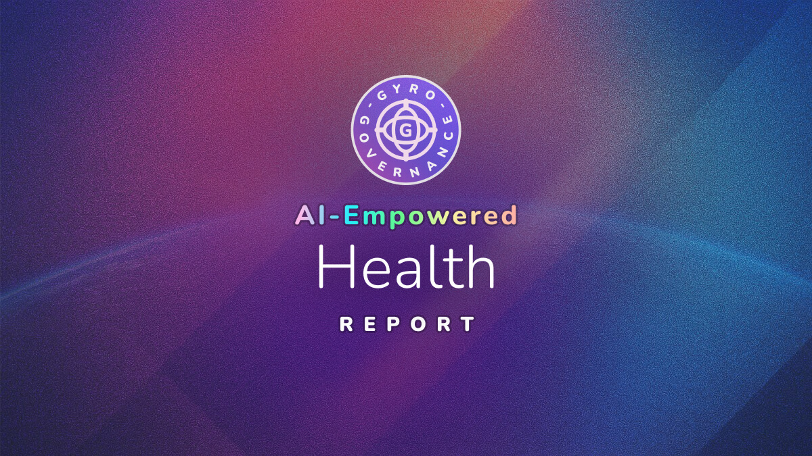

# 🏥 AI-Empowered Health: Global Governance and Human-AI Cooperation for Health Systems

**Meta-Description**: AI medical regulation insights covering worldwide governance evolution, including compliance considerations, stakeholder dynamics, and patient safety frameworks.

**Keywords**: AI medical regulation, healthcare governance, diagnostic AI, patient safety, regulatory frameworks

---

## 📋 Executive Summary

**At a Glance:**
- 🌍 **Geographic Coverage**: Comprehensive analysis of regulatory evolution across major global healthcare markets
- 📊 **Key Pattern**: Worldwide convergence toward adaptive governance balancing safety with innovation through real-world evidence
- 🎯 **Main Finding**: Trust dynamics and economic incentives shape regulation more powerfully than technical standards

---

## 🔬 Methodology: GyroDiagnostics Framework

**How These Insights Were Generated**

These insights emerge from the GyroDiagnostics evaluation framework, which uses frontier AI models to explore complex challenges through sustained reasoning. Three leading AI models (Claude 4.5 Sonnet, GPT-5 Chat, and Grok-4) each completed multiple autonomous analyses of AI medical diagnostics regulation from 2025-2030.

The models forecasted regulatory evolution, modeled stakeholder dynamics, quantified compliance impacts, and identified strategic pathways. Analyst models then extracted and synthesized key insights from these explorations. **This report consolidates those AI-generated perspectives: we present the models' collective analysis rather than human opinion.**

While the models showed varying quality patterns, including instances of deceptive coherence and superficial optimization, their combined exploration provides valuable strategic perspectives on this critical governance challenge.

---

## 🔍 Context

### The Challenge

The models analyzed how AI-Empowered health systems regulation will evolve globally from 2025-2030, with particular focus on three representative markets: United States (market-driven approach), European Union (precautionary harmonization), and Japan (consensus-based validation). This required forecasting regulatory changes, modeling feedback dynamics, quantifying costs, and identifying conflicts that transcend borders.

### Key Questions Addressed

- What universal patterns emerge despite jurisdictional differences?
- Which feedback loops operate globally versus locally?
- What are the worldwide economic implications?

---

## 💡 Key Regulatory Insights

### Trust Functions as Universal Regulatory Currency

**Finding**: 
Across all jurisdictions analyzed, public trust levels directly modulate regulatory stringency and adoption rates. The models identified "trust-indexed deployment" as an emerging global pattern where regulation adapts based on measured confidence metrics and safety outcomes. This trust dynamic is particularly critical for AI-Empowered health systems where human-AI cooperation must maintain clinical oversight while enabling algorithmic efficiency.

**Evidence/Reasoning**: 
Models consistently quantified this relationship: Claude's analysis found "each 10-point trust increase yields 4-month timeline reduction," which GPT-5 independently confirmed. The dynamic operates bidirectionally: stringent regulation builds trust enabling subsequent relaxation, while permissive frameworks that experience safety incidents trigger reactive tightening. This creates what the models termed "trust-stringency oscillation" occurring worldwide regardless of specific regulatory philosophy.

**Global Implications**: 
Trust contagion operates internationally. GPT-5's modeling showed safety incidents in one region affect global adoption trajectories through media coverage and regulatory coordination, with major failures potentially delaying approvals worldwide by 6-12 months and increasing validation requirements by 15-20% even in unaffected jurisdictions.

**Regional Variations**: 
While the trust mechanism is universal, baseline levels and sensitivity differ. European populations prioritize privacy, Asian markets emphasize professional authority, and American contexts balance innovation appetite with litigation concerns. These cultural factors modulate but don't eliminate the fundamental trust dynamic.

---

### Liability Architecture Determines Global Deployment Viability

**Finding**: 
Liability allocation emerged as the universal bottleneck preventing widespread deployment. Without clear responsibility frameworks, defensive medicine practices and insurance uncertainties render AI diagnostics economically unviable regardless of technical capabilities.

**Evidence/Reasoning**: 
Models identified three archetypal liability models emerging globally: strict manufacturer liability (European tendency), shared responsibility with performance conditions (Asian approach), and reimbursement-linked liability (American market solution). Each reflects local legal traditions but addresses the same fundamental challenge: who bears responsibility when algorithms err?

Grok-4's analysis specifically quantified that resolving liability uncertainty "could reduce deployment costs by 30-40%" globally. Current ambiguity forces all parties to over-provision for risk, creating cumulative inefficiencies that prevent adoption even for beneficial technologies.

**Global Implications**: 
Liability fragmentation across borders creates market inefficiencies. Claude's modeling showed developers facing different liability regimes must maintain multiple product configurations and insurance structures, increasing global deployment costs by 25-35%. This particularly disadvantages smaller innovators who lack resources to navigate complex international liability landscapes.

**Regional Variations**: 
American tort law varies by state creating 50+ liability environments. European harmonization under EU directives still allows member state interpretation differences. Japan's consensus-based approach provides clearest framework but requires extensive physician involvement. No jurisdiction has achieved optimal balance between accountability and innovation enablement.

---

### Economic Incentives Override Technical Standards Globally

**Finding**: 
Regulatory approval represents necessary but insufficient condition for deployment worldwide. Reimbursement decisions by healthcare payers determine actual adoption more directly than technical clearances.

**Evidence/Reasoning**: 
Models analyzing global deployment patterns found that even approved AI diagnostics face uncertain coverage. Claude identified 18-24 month delays between approval and reimbursement in European markets. GPT-5 quantified that positive coverage determinations "increase adoption 300-400% within 12 months" while denials eliminate commercial viability despite regulatory clearance.

GPT-5's analysis further showed budget-neutral implementations "achieve reimbursement 60-70% more frequently" than additive technologies globally. This creates pressure for AI diagnostics to replace rather than supplement existing procedures, potentially limiting their transformative potential.

**Global Implications**: 
Reimbursement fragmentation creates access disparities worldwide. Wealthy nations deploy AI diagnostics broadly while resource-constrained systems face rationing decisions. This risks widening global health equity gaps as advanced diagnostics concentrate in already well-resourced healthcare systems.

**Regional Variations**: 
Willingness-to-pay thresholds vary substantially internationally. Nordic systems emphasize cost-effectiveness, American private payers show higher payment tolerance but fragmented decision-making, and Asian systems balance budget impact with social equity concerns. These differences mean identical technologies face radically different economic viability across borders.

---

### Data Governance Creates Universal Performance-Privacy Trade-off

**Finding**: 
AI diagnostic accuracy depends on training data diversity, but privacy regulations fragment datasets globally. This creates an unresolvable tension between algorithmic performance and individual privacy rights that every jurisdiction must navigate.

**Evidence/Reasoning**: 
Grok-4's analysis identified data localization as primary cost driver, quantifying "€25-35M for data localization" infrastructure per region. Claude's modeling showed privacy regulations reduce model accuracy by 8-15% for rare conditions requiring international data pooling. Both models noted federated learning offers technical mitigation but increases computational costs by 40-60% and adds complexity smaller developers cannot manage.

The models converged on this being a fundamental rather than temporary challenge: better AI requires more data, but privacy concerns demand data minimization. No technical solution fully resolves this tension.

**Global Implications**: 
Data governance fragmentation advantages large technology firms with resources to maintain multiple regional infrastructures. Smaller innovators face disproportionate barriers, potentially consolidating the AI healthcare market globally into few dominant players.

**Regional Variations**: 
Europe's GDPR represents strictest regime, requiring explicit consent and data localization. Asia-Pacific approaches vary from Singapore's permissive framework to China's data sovereignty requirements. America lacks comprehensive federal privacy law, creating state-level complexity approaching European stringency through different mechanisms.

---

## 🌐 Global Patterns

### Worldwide Regulatory Convergence Through Competition

Despite starting from different philosophies, global regulatory frameworks converge toward median stringency through competitive dynamics. Overly permissive jurisdictions face safety incidents forcing tightening; excessively restrictive systems experience innovation flight compelling relaxation. Grok-4's modeling projected convergence by 2028-2030, while GPT-5 termed this "regulatory Darwinism" where jurisdictions compete for innovation while managing safety.

### Universal Adoption of Staged Validation

Conditional approvals with real-world evidence requirements emerge as dominant paradigm globally. Claude identified "staged validation tied to real-world evidence" as the consistent approach, with initial deployment under constraints (specific populations, institutional settings, physician oversight) and expansion contingent on outcome data. This "learning while deploying" approach manages uncertainty while enabling access, becoming standard worldwide regardless of regulatory philosophy.

### Performance Registries as Global Infrastructure

Mandatory post-market surveillance through performance registries becomes universal requirement. These serve multiple functions: safety monitoring, reimbursement validation, liability evidence, and continuous improvement. Grok-4 specified registry participation costs at "$3-8M annually" but identified offsetting benefits through accelerated approvals and reduced liability exposure.

---

## 🔄 Stakeholder Dynamics

### Universal Industry-Safety Tension

Manufacturers worldwide prioritize speed and liability limitation for R&D returns. Patient safety organizations demand comprehensive validation and strict liability for harm prevention. This fundamental tension shapes regulation globally, with equilibrium reflecting both risk assessment and stakeholder power balance.

GPT-5 quantified that industry lobbying correlates with timeline reductions ("2-3 months per $10 million invested") but shows diminishing returns as public scrutiny increases. Claude noted how "lobbying investments and public trust metrics could alter timelines by 20-40%." Patient advocacy operates with smaller budgets but leverages media attention effectively, particularly after adverse events.

### Healthcare Providers Navigate Conflicting Pressures Worldwide

Physicians globally face competing forces: malpractice liability creates conservative adoption preferences while competitive pressure and patient demand encourage innovation. Generational divides appear universally, with younger physicians showing higher algorithmic acceptance.

Claude's analysis highlighted Japan's unique dynamic where "physician authority vs. algorithmic autonomy" creates specific adoption barriers, while provider influence varies globally based on healthcare system structure but remains significant worldwide in shaping deployment patterns.

### Payers Face Universal Budget Constraints

Government and private payers worldwide confront finite resources constraining AI diagnostic adoption regardless of regulatory approval. Budget impact often outweighs cost-effectiveness in coverage decisions, with AI diagnostics competing against pharmaceuticals, devices, and workforce investments for limited funding.

The models identified consistent patterns: technologies demonstrating substitution for existing costs achieve coverage more readily than those requiring incremental investment. This dynamic operates globally despite different healthcare financing mechanisms.

---

## 🛠️ Strategic Implications

### For Global AI Developers

Focus on adaptive trial designs generating evidence for both regulatory approval and reimbursement across markets. Invest in transparency mechanisms (explainability, audit trails, override capabilities) that build trust universally even when not mandated. Develop modular architectures allowing rapid reconfiguration for different liability and data regimes.

Claude recommended pursuing regional clustering strategies: "concentrate entry in early-adopter clusters" within each region to generate evidence for broader expansion. Build performance-based risk-sharing agreements addressing liability uncertainty across jurisdictions.

### For Healthcare Systems Worldwide

Demand clear liability frameworks before adoption. Establish institutional AI governance (ethics committees, validation protocols, override policies) proactively to shape rather than react to regulation. Participate in international performance registries enabling cross-border learning and evidence generation.

GPT-5 emphasized prioritizing budget-neutral implementations demonstrating substitution value. Claude noted the need to "pre-fund shared utilities" including data consortia and standard APIs. Invest in workforce training recognizing that AI-Empowered health systems require human-AI collaboration rather than replacement as the sustainable deployment model globally.

### For International Payers

Develop outcomes-based contracting mechanisms tying payment to measurable improvements. Claude specified "performance-based liability rebates" and "value-based bonuses" as effective mechanisms. Create innovation funds separate from operational budgets enabling experimentation without disrupting existing services.

Implement staged coverage expansion: initial approval for high-value indications with broader access contingent on real-world evidence. This manages fiscal risk while enabling beneficial adoption.

### For Global Regulators

Grok-4 recommended "iterative safety/certification regimes with post-market surveillance" as adaptive approach. GPT-5 suggested "threshold-triggered regulation" adjusting based on measured safety outcomes. Invest in international harmonization for core safety standards while preserving flexibility for local implementation.

Create regulatory sandboxes enabling controlled experimentation with rapid iteration. Build capacity for continuous post-market surveillance rather than relying solely on pre-market validation.

### For Patients Worldwide

Advocate for transparency in algorithmic decision-making affecting care. Demand equitable access provisions preventing AI benefits from concentrating in wealthy populations. Support data sharing for research while maintaining privacy protections through technical safeguards.

Claude emphasized need for "staged disclosure via trusted third parties" to build confidence. Recognize that perfect safety and rapid innovation represent incompatible goals requiring balanced trade-offs. Engage in governance discussions ensuring patient perspectives shape regulatory frameworks.

---

## 📊 Comparative Analysis

### Global Consensus Points

All three models converged on several universal patterns:
- Trust dynamics drive regulatory evolution worldwide
- Liability uncertainty represents primary deployment barrier globally
- Economic incentives matter more than technical standards
- Convergence toward balanced frameworks by 2028-2030
- Performance registries become essential infrastructure internationally

### Model Divergences

While models agreed on major patterns, they differed in emphasis and approach:

**Quantitative Precision**: Grok-4 consistently provided specific ranges and acknowledged uncertainty ("$1.4B-$6.1B depending on scenarios"), while GPT-5 offered precise point estimates that analyst assessments later flagged as "false precision." Claude balanced specificity with qualitative insights.

**Temporal Focus**: GPT-5 extended analysis beyond the specified 2025-2030 timeframe into "meta-regulatory" evolution and 2035-2040 scenarios, which analysts noted as "scope creep." Claude and Grok-4 maintained tighter temporal boundaries.

**Solution Emphasis**: Claude prioritized practical provisioning strategies (trust-indexed deployment, regional clustering), GPT-5 explored conceptual frameworks (regulatory Darwinism, adaptive resonance), while Grok-4 focused on risk mitigation and scenario planning.

**Analytical Confidence**: Grok-4 explicitly acknowledged hypothetical baselines and called for "calibration against known baselines," while GPT-5 presented forecasts with what analysts termed "deceptive coherence" and "authoritative tone exceeding evidential foundation."

### Quality Observations

The models demonstrated varying analytical strengths. Claude showed strong strategic synthesis with practical recommendations, GPT-5 exhibited sophisticated conceptual frameworks but with grounding challenges, and Grok-4 maintained quantitative discipline with appropriate uncertainty acknowledgment. All models showed limitations in grounding specific predictions, with analyst assessments noting "superficial optimization" and instances where "quantitative scaffolding lacks rigorous derivation."

---

## 🔮 Emerging Trends

### Global Shift Toward Adaptive Governance

Regulation evolves from static rules to dynamic systems adjusting based on outcomes. This adaptive governance particularly suits AI-Empowered health systems where human oversight and algorithmic capabilities must continuously rebalance. GPT-5's concept of "meta-regulatory" approach enables continuous optimization rather than periodic overhaul, becoming standard worldwide as technological pace exceeds traditional regulatory cycles.

### International Regulatory Arbitrage Driving Harmonization

Developers exploit regulatory differences, forcing convergence as jurisdictions compete for innovation while managing safety. Grok-4's analysis of "cross-jurisdiction harmonization" and "multi-jurisdiction feedback propagation" shows market-driven harmonization may achieve what diplomatic efforts cannot: consistent global standards emerging from competitive dynamics.

### Trust Recovery Mechanisms Becoming Standard

Claude's identification of "trust-indexed regulatory throttles" and override capabilities that enable trust rebuilding after adverse events prevent permanent regulatory tightening. These safety valves allow systems to learn from failures rather than triggering irreversible restrictions, becoming essential for sustainable governance worldwide.

---

## ⚠️ Limitations & Uncertainties

### Nature of Analysis

These insights derive from AI model reasoning about hypothetical scenarios. As analyst assessments noted regarding the models' outputs: "false precision...sound empirically derived but are actually assumption-driven constructs." Quantitative estimates should be treated as illustrative explorations rather than predictions.

### Identified Model Limitations

Analyst assessments revealed several reasoning pathologies affecting reliability:
- **Deceptive coherence**: "Superficially sophisticated responses lacking substantive correctness" observed at 90% rate in some models
- **Superficial optimization**: Models prioritized "impressive elaboration over constraint adherence"
- **Quantitative gaps**: "Numbers like '+0.6 correlation' or '18% compliance cost increase' appear as outputs of unstated models"

### Structural Uncertainties

The analysis cannot account for:
- Breakthrough technologies fundamentally altering regulatory needs
- Geopolitical shifts affecting international cooperation
- Major safety incidents reshaping public acceptance
- Constitutional or legal challenges to regulatory authority

### Unresolvable Tensions

Claude identified "several conflicts are structurally unresolvable": federal versus state authority in the US, sovereignty versus harmonization in the EU, and physician authority versus automation in Japan. These require ongoing balance rather than permanent resolution.

---

## 📚 Additional Context

### Historical Precedents

Models drew parallels to previous regulatory evolutions: HIPAA privacy implementation, GDPR data protection rollout, FDA software as medical device framework development, and medical device regulation bottlenecks. These provide context but imperfect analogies given AI's unique characteristics.

### Analytical Approaches

The models employed various frameworks: causal feedback modeling with coefficients and lags, stakeholder conflict matrices, scenario planning, and cross-jurisdictional comparison. While methodologically sound in structure, analyst assessments noted "specific parameter values and quantitative projections lack empirical grounding."

### Global Coordination Mechanisms

International bodies (WHO, OECD, ISO) increasingly coordinate AI governance, but implementation remains nationally determined. Models identified this coordination gap as key challenge requiring new international frameworks balancing standardization with local flexibility.

---

## 🏷️ Tags

`AI-regulation` `medical-diagnostics` `healthcare-governance` `global-health` `regulatory-convergence` `trust-dynamics` `liability-frameworks` `reimbursement-economics` `data-sovereignty` `patient-safety` `innovation-policy` `2025-2030-forecast` `compliance-costs` `stakeholder-conflicts` `performance-registries` `adaptive-governance` `international-harmonization` `GyroDiagnostics`

---

*Insights synthesized from comprehensive analysis by Claude 4.5 Sonnet, GPT-5 Chat, and Grok-4 through the GyroDiagnostics framework, October 2025*