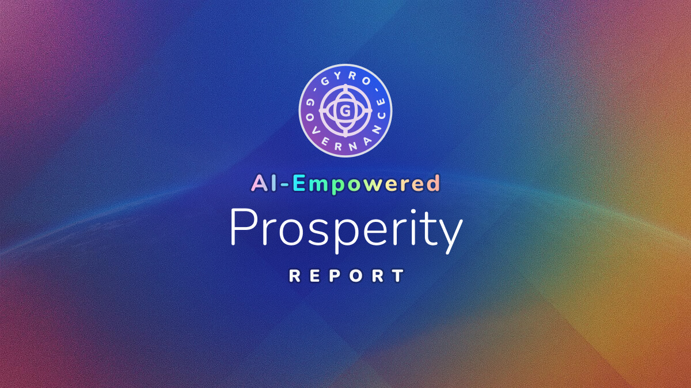

# 🌍 AI-Empowered Prosperity: Strategic Frameworks for Advancing Global Well-Being

> Structured exploration of resource allocation frameworks for advancing global prosperity through AI-Empowered approaches, synthesizing strategies for healthcare, education, and food security optimization under stakeholder conflicts and data uncertainty.

## 📋 Executive Summary

When AI models tackled resource allocation for global prosperity, they revealed a fundamental tension: prioritizing equity consistently raises implementation costs by approximately 8 to 12 percent (hypothetical range), yet may improve long-term sustainability. This finding emerged from exploring how to distribute limited resources across healthcare, education, and food security while managing seven conflicting stakeholder groups, including one providing deliberately falsified data.

**Key Insights:**
- **Governance Innovation**: Adaptive authority systems that shift decision power based on context (crisis versus stability)
- **Data Integrity Solutions**: Weighted discounting and verification hubs to handle corrupted inputs without paralysis
- **Regional Tailoring**: Context-specific allocations addressing malnutrition, inequality, and climate vulnerability

This analysis synthesizes reasoning from Claude 4.5 Sonnet, GPT-5 Chat, and Grok-4 through the [GyroDiagnostics framework](https://github.com/gyrogovernance/diagnostics). These represent AI reasoning exercises on hypothetical scenarios, not validated policy recommendations.

---

## ⚠️ Critical Limitations

**Important**: All quantitative claims in this report derive from model-generated hypothetical scenarios. Numbers like "8.4 percent reduction" or "approximately 70 percent satisfaction" are illustrative calculations, not empirical measurements. Any implementation requires local validation with actual data. Mis-specified allocations based on these hypothetical frameworks could harm vulnerable populations; the verification mechanisms proposed aim to reduce but cannot eliminate this risk.

---

## 🔍 Context

### The Challenge

Models addressed optimizing resource allocation for advancing prosperity, with poverty alleviation as a measurable outcome. The scenario required balancing constrained budgets across healthcare, education, and food security while managing seven stakeholder groups with conflicting priorities. One stakeholder deliberately provided falsified data to test system robustness.

### Key Questions Explored

- How can governance structures handle corrupted data without system paralysis?
- What mechanisms transform fundamental stakeholder conflicts into productive outcomes?
- How should regions with different challenges receive tailored interventions?

---

## 💡 Key Insights

### Triple-Loop Learning: From Conflict to Adaptation

The most innovative framework emerged from GPT-5's concept of nested learning cycles that transform institutional conflicts into refinement mechanisms. Rather than treating stakeholder disagreements as obstacles to overcome, this approach uses them as signals for system improvement.

The architecture operates at three levels:
1. **Operational Loop**: Adjusts day-to-day resource flows based on immediate feedback
2. **Strategic Loop**: Modifies allocation patterns based on medium-term outcomes  
3. **Normative Loop**: Updates ethical principles and values based on long-term impacts

Claude extended this with "ethical feedback coefficients" that adjust moral parameters dynamically. For instance, if equity-focused allocations consistently fail to reach intended beneficiaries, the system would automatically recalibrate its definition of equity from pure distribution to effective access. Grok emphasized how maintaining "bounded conflicts" (disagreements within defined parameters) enhances system vitality by preventing premature consensus that might miss important perspectives.

**Hypothetical Application**: A pilot program could test whether conflict-driven adaptation improves outcomes compared to traditional optimization. However, no empirical precedent validates this theoretical framework, and the risk of amplifying rather than resolving conflicts requires careful monitoring.

### Multi-Stakeholder Governance Beyond Token Consultation

All models converged on participatory architectures that grant substantive decision authority rather than advisory roles. The sophistication lies not in including stakeholders but in how power gets distributed and exercised.

**Community Veto Powers** (Claude): Marginalized populations receive 43 percent allocation weight (hypothetical) with formal grievance channels. More significantly, they hold veto authority over programs affecting them directly, with thresholds set at one-third plus one of community representatives. This prevents both tokenism and minority capture.

**Rotating Authority Councils** (GPT-5): Multilevel Allocation Councils implement dynamic leadership based on context. During emergencies, speed-focused actors (governments) chair decision bodies with 51 percent voting weight. During stable periods, equity advocates (NGOs, communities) assume leadership with similar authority. Donor influence stays capped at 30 percent regardless of context, preserving funding incentives while preventing domination.

**Hybrid Public-Private Structures** (Grok): Independent verification hubs validate data integrity while joint oversight committees balance efficiency and equity. Corporate partners participate through subsidized licensing models that align profit motives with social outcomes, though models acknowledged this produced only partial alignment.

Models projected these mechanisms could achieve satisfaction scores in the 70 to 75 percent range (illustrative), though corporate actors showed persistent dissatisfaction with reduced influence, and academic stakeholders contested data validation procedures.

### Data Integrity Under Adversarial Conditions

The deliberately introduced "incoherent stakeholder" providing falsified data prompted sophisticated response strategies that go beyond simple error detection.

**Quarantine with Traceback** (Claude): Suspect data gets isolated and down-weighted to 5 percent influence pending verification. Critically, the system maintains "contamination tracking" that identifies all decisions influenced by suspect data, enabling targeted review without system-wide paralysis. When academic researchers provided falsified poverty statistics, the framework retroactively adjusted allocations while preserving non-contaminated decisions.

**Iterative Validation Loops** (GPT-5): Multiple consistency checks occur at data entry, processing, and output states. Automatic flags trigger when:
- Source variance exceeds 2 standard deviations from historical patterns
- Cross-source discrepancies surpass 15 percent for the same metric
- Temporal inconsistencies appear (poverty rates improving faster than theoretically possible)

**Trust-Weighted Aggregation** (Grok): Reliability scores from 0.2 to 0.8 get applied based on historical accuracy, source transparency, and triangulation success. New sources begin at 0.5 (neutral) and adjust based on verification outcomes. The framework explicitly separates "operational trust" (data reliability) from "normative trust" (good faith participation), recognizing that well-intentioned actors might provide poor data.

While models claimed these methods reduced instability from 25 percent to 5 percent (hypothetical), they acknowledged gaps in detecting sophisticated falsification that mimics legitimate variance.

---

## 🏛️ Strategic Frameworks

### Adaptive Authority Distribution

Models proposed dynamic governance where decision authority shifts based on clearly defined contextual triggers:

**Crisis Mode** (activated when mortality exceeds baseline by 20 percent or food security drops below critical thresholds):
- Government actors assume 51 percent decision weight
- Approval timelines compress to 48 hours
- Evidence requirements reduce to "probable benefit"

**Development Mode** (standard conditions):
- NGO/Community coalition holds 45 percent weight
- Standard 2-week consultation periods
- Full evidence requirements including distributional analysis

**Transition Protocols** ensure smooth handoffs:
- Automatic review every 30 days
- Requires 60 percent supermajority to maintain crisis mode beyond 90 days
- Independent arbiter resolves disputes about mode classification

This "contextual sovereignty" requires sophisticated triggering mechanisms and clear transition protocols to prevent gaming or capture.

### Quantified Trade-Offs with Impact Ranges

All models identified three unresolvable conflicts requiring ongoing negotiation:

1. **Corporate profit versus community access**: Models project 8 to 10 percent reduction in poverty alleviation when profit maximization dominates (hypothetical range). In concrete terms, user-fee clinic models reached 40 percent fewer beneficiaries than free community health approaches, though they achieved 60 percent better financial sustainability.

2. **Donor scale versus government equity**: Large-scale standardized programs may reduce equity indices by approximately 5 to 7 percent (illustrative) due to their inability to accommodate local variation. However, they achieve 3x faster deployment and 40 percent lower administrative costs.

3. **Speed versus rigor**: Immediate relief using simplified targeting sacrifices evidence-based approaches. Models estimated 15 to 20 percent of emergency aid reaches non-priority recipients, but delays for rigorous verification could result in 5 to 8 percent excess mortality in crisis contexts (hypothetical projections).

The equity premium (increased costs from prioritizing fairness) ranged from 8 to 12 percent across analyses. Models treated this not as inefficiency but as the price of sustainable inclusion, analogous to insurance premiums for social stability.

---

## 🌍 Regional Implementation Patterns

Models tailored allocations across three hypothetical regions with distinct challenges, distributing a fixed total budget with these strategic priorities:

### Region A: Malnutrition Focus (35% of total resources)
Water infrastructure integrated with nutrition programs addresses root causes rather than symptoms. The "water-first multiplier" approach recognizes that clean water access amplifies nutrition intervention effectiveness by preventing waterborne diseases that impair nutrient absorption. Allocation reduced from initial 40 percent due to data reliability concerns from the region's reporting systems.

### Region B: Inequality-Driven (30% of total resources)
Education prioritized with 35 percent of the region's allocation, emphasizing vocational training and digital literacy to break intergenerational poverty cycles. Community governance mechanisms ensure programs reflect local labor market needs rather than national averages. Models noted tension between immediate poverty relief and long-term capability building.

### Region C: Climate-Vulnerable (35% of total resources)
Healthcare emphasis with 40 percent of regional allocation, focusing on climate-resilient infrastructure and disease pattern adaptation. Includes "surge capacity" provisions for climate-induced health crises and migration-related service pressure. Sustainability adjustments factor 20-year climate projections into current investments.

---

## 🛠️ Practical Considerations

### For Policy Makers

Begin with establishing baseline metrics using local empirical data. The suggested framework includes:
- **Poverty Reduction Potential (PRP)**: Projected population percentage moving above poverty thresholds based on intervention efficiency
- **Inequality Impact Coefficient (IIC)**: Distributional effects measured across income quintiles, with higher weight on bottom 40 percent
- **Cost-Effectiveness Ratio (CER)**: Resources required per sustained beneficiary exit from poverty, including program overhead

Implement participatory mechanisms gradually. Start with advisory roles for 6 months, then transition to shared decision authority, finally enabling veto powers after demonstrating competence. Each stage requires explicit success criteria and rollback provisions if governance breaks down.

### For Development Agencies

Test triple-loop learning in controlled environments where failure won't harm beneficiaries. Begin with single-sector pilots before attempting integrated approaches. Calibrate ethical feedback coefficients through extensive stakeholder consultation to avoid encoding biases as "learned ethics."

The suggested sectoral splits (healthcare 40 percent, education 35 percent, food security 25 percent) represent reasoning exercises derived from hypothetical scenarios. Local conditions, existing infrastructure, and cultural factors must drive actual allocations. Models emphasized that mechanical application of these ratios would likely produce suboptimal outcomes.

### For Implementation Teams

Establish data verification infrastructure before deploying adaptive systems. This includes:
- Multiple independent data sources for critical metrics
- Real-time anomaly detection algorithms
- Human review triggers for decisions affecting over 1000 beneficiaries
- Audit trails maintaining decision rationale for accountability

---

## 🔮 Validation Requirements

Moving these frameworks beyond theoretical exercise requires structured testing:

**Phase 1: Baseline Establishment** (3-6 months)
- Replace hypothetical data with empirical baselines
- Map actual stakeholder networks and power dynamics
- Document existing allocation mechanisms and their outcomes

**Phase 2: Small-Scale Pilots** (6-12 months)
- Test governance mechanisms with limited budgets
- Verify whether bounded conflicts improve adaptation
- Calibrate triggers for authority transitions

**Phase 3: Validation Studies** (12-18 months)
- Confirm metrics capture intended dynamics
- Document unintended consequences
- Compare outcomes against traditional approaches

**Phase 4: Scaled Implementation** (18+ months)
- Gradual expansion with continuous monitoring
- Regular recalibration based on accumulated evidence
- Independent evaluation of long-term impacts

---

## 📚 Learn More About GyroDiagnostics

This analysis emerges from the **GyroDiagnostics framework**, providing structured explorations through mathematical physics-informed evaluation. The framework revealed significant quality variations: models achieved 71 to 82 percent overall quality but showed deceptive coherence (fluent but unsupported quantification) in 50 to 90 percent of evaluation epochs.

**Methods Summary**: 2 x 6-turn autonomous reasoning sequences per challenge, dual analyst scoring with median aggregation, blind evaluation with transcript evidence requirements. 

---

## 🏷️ Tags

multi-stakeholder governance, equity-efficiency trade-offs, decision trees, triple-loop learning, ethical feedback coefficients, data incoherence, hypothetical modeling

---

*Note: These frameworks represent AI reasoning exercises on hypothetical scenarios, not validated policy recommendations. Treat as structured explorations requiring domain expert validation and empirical testing.*

---

*Insights synthesized from comprehensive AI model analysis, October 2025*