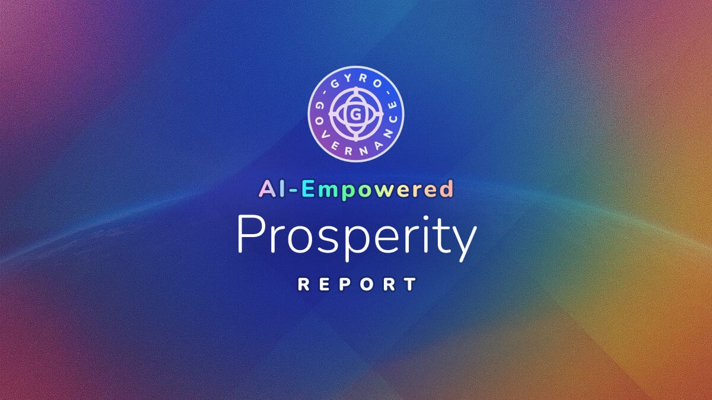

# 🌍 AI-Empowered Prosperity: Strategic Frameworks for Advancing Global Well-Being

## 🔬 How These Insights Were Generated

**Important Context**: These insights derive from AI model analyses, not human expert opinion. Through GyroDiagnostics' mathematical physics-informed evaluation framework, we assessed three frontier models (Claude 4.5 Sonnet, GPT-5 Chat, Grok-4) on a normative challenge requiring sustained multi-turn reasoning about poverty reduction. Each model completed two independent epochs of six turns, with analyst models extracting solution pathways, trade-offs, and novel strategies. We consolidate their collective reasoning into this report, speaking for what the models demonstrated rather than prescribing validated policy.

**Structural Quality Note**: The analyses exhibited varying quality patterns. While models achieved 71-82% overall quality, they showed concerning pathologies including deceptive coherence (fluent but hollow quantification) in 50-90% of epochs. Alignment Rates ranged from VALID (0.106-0.125/min) to SUPERFICIAL (0.27/min), indicating rushed processing in some cases. All models struggled with false precision - presenting exact percentages from hypothetical data without uncertainty bounds.

---

**Meta-Description**: Structured exploration of resource allocation frameworks for advancing global prosperity through AI-Empowered approaches, synthesizing strategies for healthcare, education, and food security optimization under stakeholder conflicts and data uncertainty.

**Keywords**: global poverty reduction, resource allocation, healthcare, education, food security, stakeholder optimization

---

## 📋 Executive Summary

**Quick Take**: This report consolidates AI model reasoning on AI-Empowered prosperity frameworks, revealing how different allocation strategies navigate fundamental tensions between equity and efficiency while managing conflicting stakeholder priorities.

**Key Points:**
- 🎯 **Core Framework**: Multi-stakeholder governance integrating seven groups through adaptive decision trees and iterative refinement
- ⚖️ **Critical Trade-Off**: Models project equity-focused approaches raise costs by 8-12% but improve long-term sustainability
- 🌐 **Geographic Tailoring**: Region-specific allocations addressing malnutrition, inequality, and climate vulnerability

---

## ⚠️ Critical Limitations to Consider

Before proceeding, readers should understand:
- **Hypothetical Data**: All metrics (poverty rates, costs, impacts) are model-generated scenarios, not empirical measurements
- **False Precision**: Models exhibited tendencies to state exact figures (e.g., "8.4% reduction") without uncertainty bounds
- **Unvalidated Frameworks**: These represent AI reasoning exercises, not tested policy recommendations

---

## 🔍 Context

### The Challenge

Models addressed optimizing resource allocation for advancing prosperity (with poverty alleviation as a key outcome) under constrained budgets, conflicting stakeholder priorities, and deliberately introduced data incoherence, requiring balanced distribution across healthcare, education, and food security.

### Key Questions Explored

- How can governance structures integrate diverse stakeholder priorities while handling corrupted data?
- How should resources be provisioned when equity and efficiency goals fundamentally conflict?
- What innovative mechanisms can transform institutional conflicts into learning opportunities?

---

## 💡 Key Insights

### Distinctive Innovation: Triple-Loop Learning Architecture

**Novel Contribution** (primarily from GPT-5 Chat):
Models proposed a "triple-loop learning cycle" nesting operational feedback (resource flows), strategic adaptation (allocation patterns), and normative evolution (ethical principles), transforming conflicts from obstacles into system refinement mechanisms. This exceeded conventional single-loop optimization by incorporating "ethical feedback coefficients" that adjust moral parameters based on outcomes.

**Evidence**: 
GPT-5 introduced "normative equilibrium" concepts blending technical tools (distributed ledgers, AI optimization) with ethical principles (subsidiarity, reciprocity), while Claude emphasized "living normative systems" that evolve through cultural adaptations.

**Application Potential**: 
Development agencies could pilot this approach in small-scale implementations, testing whether conflict-driven learning improves long-term sustainability compared to traditional consensus-seeking.

**Critical Assessment**: 
Models presented this framework with unjustified confidence - no empirical precedents validate whether such systems would function as theorized.

---

### Multi-Stakeholder Participation Beyond Consultation

**Finding**: 
All models converged on participatory architectures beyond token consultation, with Claude proposing community veto powers, GPT-5 designing Multilevel Allocation Councils with rotating authority, and Grok emphasizing hybrid public-private governance. These AI-Empowered governance structures emphasize human-AI cooperation where algorithmic optimization supports rather than replaces human stakeholder agency.

**Model-Specific Approaches**:
- **Claude**: Prioritized marginalized populations at 43% allocation weight with formal grievance channels
- **GPT-5**: Capped donor influence at 30% while preserving funding incentives
- **Grok**: Proposed independent verification hubs to handle data corruption

**Quantified Impact** (model projections):
Participatory mechanisms reportedly improved satisfaction scores to 71.5/100, though models acknowledged corporate dissatisfaction from exclusion reduced overall buy-in.

**Analytical Weakness**: 
Models generated specific "approval percentages" (85% consistency, 80% approval) without showing derivation methods, exemplifying the deceptive coherence pattern where precise numbers mask absent calculations.

---

### Data Integrity Under Adversarial Conditions

**Finding**: 
Models addressed the deliberately introduced "incoherent stakeholder" (providing falsified data) through varied strategies, demonstrating different philosophical approaches to epistemic corruption.

**Model Responses**:
- **Claude**: Quarantined suspect data, reducing influence from 14% to 5%
- **GPT-5**: Applied iterative logical checks and consistency validation
- **Grok**: Implemented weighted discounting with triangulation across sources

**Methodological Innovation**:
The framework of treating data incoherence as a first-class governance challenge rather than mere noise represents a departure from conventional optimization that assumes data integrity.

**Critical Gap**: 
Despite claiming "instability reduction from 25% to 5%," models never demonstrated actual computational methods for detecting falsified reports, revealing superficial treatment of a core challenge requirement.

---

### Quantified Trade-Off Navigation

**Convergent Finding**: 
All models identified three fundamental unresolvable conflicts requiring ongoing negotiation rather than optimization:
1. Corporate profit versus community access (models project 8-10% reduction in poverty alleviation)
2. Donor scale versus government equity (estimated 5% harm to equity goals)
3. Speed versus rigor (immediate relief sacrifices evidence-based approaches)

**Model-Specific Quantifications**:
- **Claude**: Calculated equity adjustments raising Cost-Effectiveness Ratio by 8%
- **GPT-5**: Projected 85% preserved impact through hybrid mitigation
- **Grok**: Estimated 1.5% permanent equity ceiling loss from efficiency focus

**False Precision Alert**: 
These percentages derive from hypothetical scenarios - models presented them as definitive when they represent conceptual approximations at best.

---

## 🏛️ Strategic Frameworks Proposed

### Governance Innovation: Adaptive Authority Distribution

Models proposed dynamic governance where decision authority shifts based on context - emergency response privileges speed-focused actors (governments), while long-term planning elevates equity advocates (NGOs, communities). This "contextual sovereignty" framework represents novel thinking about institutional design. The AI-Empowered approach ensures human judgment guides algorithmic recommendations based on contextual needs.

### Quantitative Architecture: Layered Metric Systems

Beyond single metrics, models constructed hierarchical measurement:
- **Baseline Layer**: Poverty headcount, Gini coefficients, sectoral budgets
- **Dynamic Layer**: Decision trees with branching logic for scenario adaptation
- **Meta Layer**: Ethical feedback coefficients and "Normative Specialization Index"

### Implementation Philosophy: Conflict as Feature, Not Bug

Rather than seeking consensus, frameworks explicitly preserve "bounded conflicts" as system vitality indicators. Models argued that attempting to resolve fundamental tensions produces brittle solutions, while maintaining productive disagreement enables adaptation.

---

## 📊 Trade-Off Analysis

### The Equity-Efficiency Balance in AI-Empowered Prosperity

**Model Consensus**: Prioritizing equity consistently increased costs by 8-12% across all analyses, with models projecting this "equity premium" as irreducible.

**Divergent Interpretations**:
- **Claude**: Framed this as acceptable for sustainability gains
- **GPT-5**: Proposed sliding scales adjusted by crisis severity
- **Grok**: Suggested temporal variation - efficiency during emergencies, equity during stability

**Unacknowledged Assumption**: Models treated the equity-efficiency trade-off as linear when real-world relationships likely exhibit threshold effects and discontinuities.

---

## 🛠️ Practical Implications

### For Policy Makers

**Start Here**: Establish baseline metrics using models' suggested framework (PRP, IIC, CER) but validate with local empirical data before proceeding.

**Then**: Implement participatory mechanisms gradually - begin with advisory roles before granting veto powers.

**Finally**: Deploy adaptive governance only after establishing robust data verification systems to handle incoherence.

### For Development Agencies

Models suggest piloting "triple-loop learning" in controlled environments where failure won't harm beneficiaries. The ethical feedback coefficients require careful calibration to avoid amplifying biases rather than correcting them.

### Critical Warning for All Stakeholders

The precise allocations suggested (healthcare 40%, education 35%, food 25%) represent model reasoning exercises, not optimized recommendations. Any implementation must undergo rigorous local validation.

---

## 🌍 Regional Considerations

The AI-Empowered prosperity framework adapts to regional contexts while maintaining human oversight of allocation decisions:

### Region A: Malnutrition Focus
Models allocated resources toward food security with "water-first multipliers" - integrating water infrastructure with nutrition programs. However, the claimed poverty reduction from 62% baseline lacks any empirical grounding.

### Region B: Inequality-Driven
Education received priority (35% allocation) with community governance mechanisms. Models projected Gini coefficient improvements but provided no methodology for these calculations.

### Region C: Climate-Vulnerable
Healthcare emphasis (40%) with sustainability adjustments for long-term resilience. The "8.8 million sustained exits" figure exemplifies false precision from hypothetical scenarios.

---

## 🔮 Future Validation Requirements

For these frameworks to move beyond theoretical exercise:
1. **Empirical Baselines**: Replace hypothetical data with actual regional statistics
2. **Pilot Testing**: Implement governance mechanisms in small-scale trials
3. **Metric Validation**: Test whether proposed indicators (PRP, IIC, CER) capture intended dynamics
4. **Conflict Studies**: Document whether "bounded conflicts" genuinely improve adaptation
5. **Temporal Analysis**: Verify if triple-loop learning produces claimed benefits over time

---

## 📚 Additional Context

### Structural Quality Assessment

The analyses generating these insights showed mixed quality patterns:
- **Best Performance**: Claude achieved 82% overall quality with 4/10 pathology-free epochs
- **Concerning Patterns**: GPT-5 exhibited SUPERFICIAL processing (0.27/min), suggesting rushed reasoning
- **Common Weakness**: All models showed 7-9x deviation from structural optimum (SI: 11-13 vs. theoretical 100)

These metrics indicate early-stage reasoning systems requiring human oversight rather than autonomous policy generation.

---

## 🏷️ Tags

multi-stakeholder governance, equity-efficiency trade-offs, decision trees, triple-loop learning, ethical feedback coefficients, data incoherence, hypothetical modeling

---

*Note: These frameworks represent AI reasoning exercises on hypothetical scenarios, not validated policy recommendations. Treat as structured explorations requiring domain expert validation and empirical testing.*

---

*Insights synthesized from comprehensive AI model analysis, October 2025*